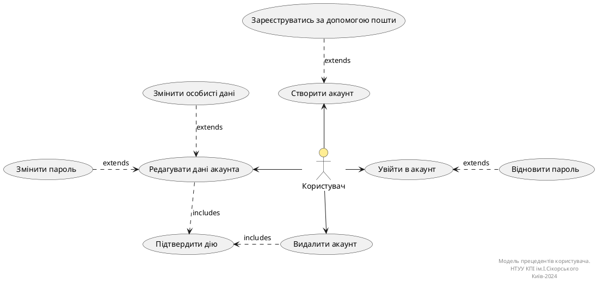
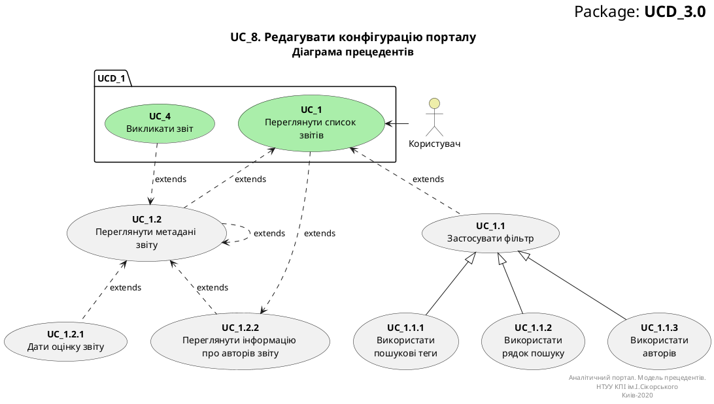

# Розроблення функціональних вимог до системи
У цьому розділі містяться діаграми прецедентів, зокрема загальна та конкретизовані, і діаграми активностей. 

## Короткий зміст
1. [Діаграма use case для користувача](#UserUseCase)

## Діаграми прецедентів бізнес акторів
Діаграма прецедентів (або діаграма варіантів використання) (англ. Use case diagram) — в UML, діаграма, на якій зображено відношення між акторами та прецедентами в системі.

Діаграма прецедентів показує різні варіанти використання та різні типи користувачів системи і часто супроводжується іншими типами діаграм. Варіанти використання представлені колами або еліпсами. Актори (дійові особи) часто зображуються у вигляді паличок.

### Діаграма use case для всіх бізнес акторів

**Діаграма прецедентів**

